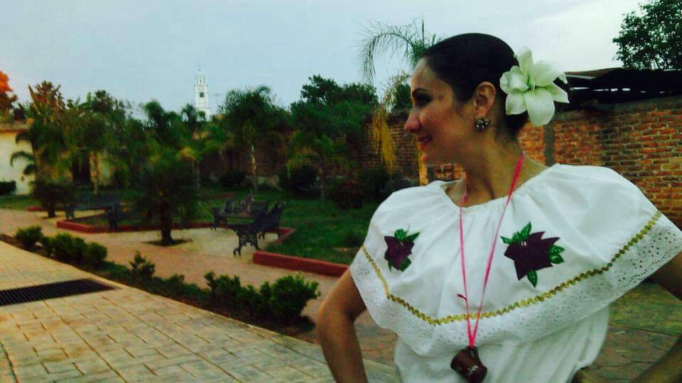

#Bienvenid@ a la página oficial de nuestro hermoso ballet "Tonantzin"  

##**Historia:**  
###Esta organización tuvo sus principios en el año de 1997 con el maestro Sergio Tellez quien en su afá de enseñar a niños del municipio de San Cristobal de la Barranca y pueblos aledaños, comenzó a impartir clases a niños y jóvenes de primaria y secundaria.
###Debido al gran éxito y la habilidad de los muchachos, desde el año 2004 hasta el año 2010 comenzaron su participación en eventos culturales nacionales llegando a alternar con invitados de Polonia, Alemania, Argentina, entre otros países en dichos eventos.
###A partir del año 2010 el ballet tomó una dirección en la cual comenzaron a trabajar de la mano del restaurant el abajeño en la minerva de Guadalajara, en el cual se daba espectáculos los viernes y sábado por la tarde. 
###Así mismo en el 2014 se comienza a intercalar los eventos del restaurant con eventos privados en los cuales se amenizan fiestas mexicanas, bodas a extranjeros y eventos en diferentes municipios del estado de Jalisco así como de la zona occidente del país.
###El ballet cuenta con 12 bailarines actualmente de los cuales 8 de ellos dan clases en escuelas privadas y de gobierno para la difusión de esta bella arte.

![Alt text] (wa2.jpeg)
![Alt text] (wa3.jpeg)
![Alt text] (wa4.jpeg)